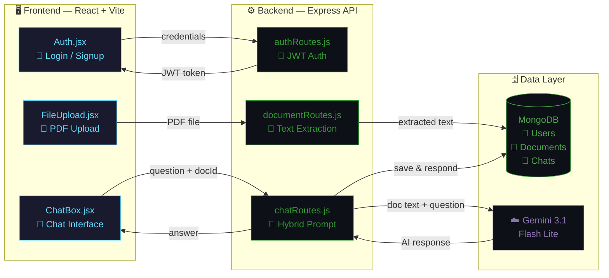
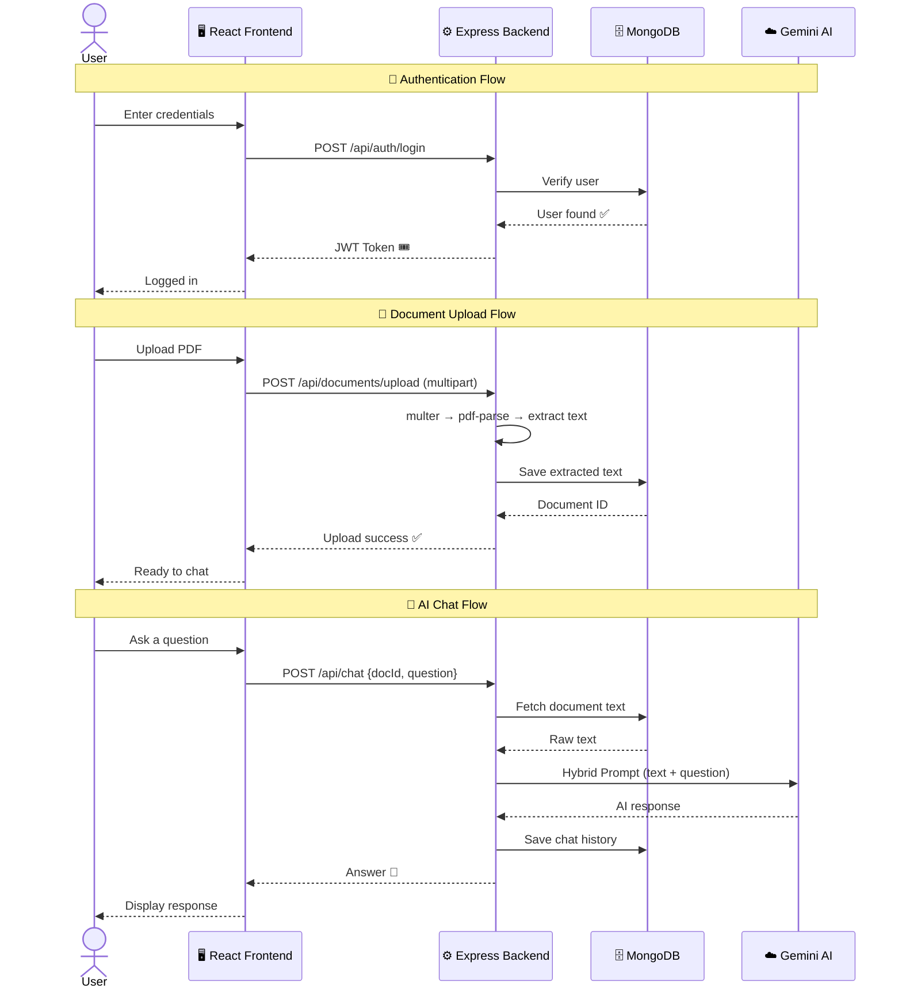

# 🤖 AI-Native Full-Stack Chatbot

A full-stack application that allows users to **securely upload PDF documents** and have **intelligent, context-aware conversations** about them using Google's **Gemini AI**.

<p align="center">
  
  
  
  
  
  
  
  
</p>

---

## 🌊 How the Code Flows (Architecture)

The application follows a clean **separation of concerns** between the React frontend and the Express backend.

### 🔐 Step 1 — Authentication

> A user signs up or logs in via `Auth.jsx`.  
> The backend (`authRoutes.js`) verifies credentials against MongoDB (`User.js`) and returns a secure **JWT** (JSON Web Token).

### 📄 Step 2 — Document Processing

> The user uploads a PDF via `FileUpload.jsx`.  
> The backend catches it using **multer** middleware.  
> The `documentRoutes.js` takes the raw file buffer, feeds it into the **pdf-parse** (v2) library to extract the text, and saves that text into the database (`Document.js`).

### 🧠 Step 3 — AI Chat Engine

> The user types a question in `ChatBox.jsx`.  
> The backend (`chatRoutes.js`) retrieves the extracted document text, combines it with the user's question, and sends a highly structured **"Hybrid Prompt"** to **Gemini 3.1 Flash Lite**.  
> The AI responds, the answer is saved to MongoDB (`Chat.js`), and it is displayed to the user.

---

## 🗺️ Visual Architecture



---

## 🔄 Request Lifecycle (Sequence)



---

## 📁 Project Structure

```text
assignment-project-chatbot/
│
├── 📂 frontend/                        # React UI (Vite + Tailwind CSS)
│   └── src/
│       ├── components/
│       │   ├── Auth.jsx                # 🔐 Handles Login / Signup
│       │   ├── FileUpload.jsx          # 📄 Handles PDF uploads to the backend
│       │   └── ChatBox.jsx             # 💬 The chat interface with the AI
│       ├── App.jsx                     # 🎛️  Main state orchestrator
│       ├── config.js                   # ⚙️  API base URL configuration
│       └── main.jsx                    # 🚀 Vite entry point
│
└── 📂 backend/                         # Node.js API (Express + MongoDB)
    ├── routes/
    │   ├── authRoutes.js               # 🔑 JWT Authentication APIs
    │   ├── documentRoutes.js           # 📑 PDF Upload & Text Extraction logic
    │   └── chatRoutes.js               # 🧠 Gemini AI Prompting & Response logic
    ├── controllers/
    │   ├── documentController.js       # 📋 Document business logic
    │   └── chatController.js           # 💬 Chat business logic
    ├── models/                         # 🗄️  Mongoose Database Schemas
    │   ├── User.js                     #     👤 User credentials & profile
    │   ├── Document.js                 #     📄 Extracted PDF text storage
    │   └── Chat.js                     #     💬 Conversation history
    ├── middleware/
    │   ├── authMiddleware.js           # 🛡️  JWT verification guard
    │   ├── uploadMiddleware.js         # 📤 Multer file upload config
    │   └── errorMiddleware.js          # 🚨 Global error handler
    └── server.js                       # 🚀 Main backend entry point
```

---

## 🚀 Getting Started

### 📋 Prerequisites

- **Node.js** v18+  
- **MongoDB** (local or Atlas connection string)  
- **Google Gemini API Key**

### ⚙️ Backend Setup

```bash
# 1️⃣  Navigate to the backend
cd backend

# 2️⃣  Install dependencies
npm install

# 3️⃣  Create your environment file
touch .env
```

Add the following to `backend/.env`:

```env
PORT=5001
NODE_ENV=development
MONGO_URI=your_mongodb_connection_string
JWT_SECRET=your_jwt_secret
GEMINI_API_KEY=your_google_gemini_api_key
```

```bash
# 4️⃣  Start the server
npm run dev        # Development (nodemon)
npm start          # Production
```

### 🖥️ Frontend Setup

```bash
# 1️⃣  Navigate to the frontend
cd frontend

# 2️⃣  Install dependencies
npm install

# 3️⃣  Start the dev server
npm run dev
```

---

## 🔗 API Endpoints

| Method   | Endpoint                  | Auth | Description                                     |
| :------- | :------------------------ | :--: | :---------------------------------------------- |
| `POST`   | `/api/auth/signup`        |  ❌  | 🔐 Register a new user                          |
| `POST`   | `/api/auth/login`         |  ❌  | 🔑 Authenticate & receive JWT                   |
| `POST`   | `/api/documents/upload`   |  🔒  | 📄 Upload PDF & extract text (`multipart/form`) |
| `POST`   | `/api/chat`               |  🔒  | 🧠 Ask a question about a document              |
| `GET`    | `/api/chat/history`       |  🔒  | 💬 Retrieve past chat conversations             |

> 🔒 = Requires `Authorization: Bearer <JWT>` header

---

## 🎤 Interview Preparation (Q&A)

Top 3 questions an interviewer might ask about this specific project architecture:

<br>

### ❓ Q1: "How does your frontend communicate with the Gemini AI?"

> **💡 Answer:**  
> The frontend **doesn't talk to Gemini directly** — that would expose the API key.  
> Instead, React (`ChatBox.jsx`) sends the user's question and the `documentId` to the Express backend.  
>  
> The backend then:  
> 1. Retrieves the extracted text for that document from **MongoDB**  
> 2. Builds a secure prompt using the **`@google/generative-ai` SDK**  
> 3. Makes the API call to **Gemini**  
>  
> Once the backend gets the response, it **saves the chat history** to the database and forwards the answer back to React.

<br>

### ❓ Q2: "How did you handle PDF parsing in your Node.js environment?"

> **💡 Answer:**  
> I used **`multer`** to intercept the file upload in memory (as a Buffer).  
> Then, I passed that Buffer into the **`pdf-parse`** library to extract the raw text.  
>  
> Interestingly, because I was using modern **ES Modules** (`import/export`) and `pdf-parse` v2 uses a **Class-based architecture**, I had to:  
> 1. Instantiate the `PDFParse` class with the buffer data  
> 2. Asynchronously extract the text using **`.getText()`**  
> 3. Immediately call **`.destroy()`** on the instance to prevent memory leaks on the server

<br>

### ❓ Q3: "How is user authentication managed across the application?"

> **💡 Answer:**  
> I implemented a **JWT (JSON Web Token)** strategy:  
>  
> 🔹 **Login:** The backend hashes the password with **`bcryptjs`**, verifies it, and signs a JWT containing the User ID  
> 🔹 **Storage:** The frontend stores this token (e.g., in `localStorage`)  
> 🔹 **Every request:** The frontend attaches the JWT in the `Authorization` header  
> 🔹 **Middleware guard:** The `authMiddleware` intercepts requests, verifies the token's signature, and attaches the user object to `req` — so every route knows exactly *who* is interacting with the system

---

<p align="center">
  Made with 🧠 Gemini AI &nbsp;·&nbsp; ⚛️ React &nbsp;·&nbsp; 🟢 Node.js &nbsp;·&nbsp; 🍃 MongoDB
</p>
